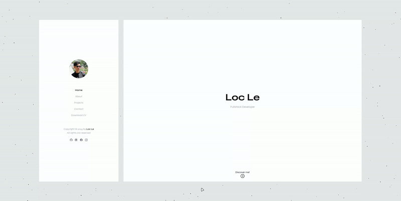

# My Portfolio Website

## Introduction
Welcome to my portfolio website! This site is designed to give you a brief introduction to who I am and showcase some of the projects I've worked on. My goal is to keep everything simple and minimalist.

Live demo: https://locle.dev



## Features

- **Minimalist Design**: The website embraces a clean and minimalist aesthetic, ensuring a distraction-free experience for visitors.
- **Reusable Components**: The site is built with modular components, making it easy to reuse and maintain across different sections.
- **Animated Background**: A subtle animated background adds a dynamic visual element, enhancing the overall user experience.
- **Web3Forms API Integration**: A contact form powered by the Web3Forms API allows visitors to send messages directly through the website.

## Installation

### Steps

1. Clone the repository

Clone the repository to your local machine and navigate into project directory:
```
git clone https://github.com/locle97/portfolio
cd portfolio
```

2. Install Dependencies

Install the necessary packages using npm:
```
npm install
```

3. Run the project locally

Start the development server and run the project locally
```
npm run dev
```

## Built with

- [React](https://react.dev/)
- [Tailwind CSS](https://tailwindcss.com/)
- [Framer Motion](https://www.framer.com/motion/)
- [TSParticles](https://particles.js.org/)

## Roadmap

- **Deployment documentation**: Add a section to guide about production deployment.
- **Dark mode**: Currently, the website only supports light mode. Adding a dark mode option will enhance user experience by providing a more comfortable viewing option, especially in low-light environments.
- **Blog Integration**: Add a blog section to share insights, tutorials, or project updates. This can also serve as a way to showcase your knowledge and keep the content dynamic.
- **Portfolio Expansion**: Add more projects and case studies, including detailed descriptions, challenges faced, and the solutions implemented. This will showcase the breadth of your work and skills.

## Contact

If you'd like to contribute or get in touch with me, feel free to reach out through the following channels:
- Linkedin: [Loc Le](https://www.linkedin.com/in/loc-le-phat-2b639020a/)
- Email: lpl212757@gmail.com
- Personal website: https://locle.dev
